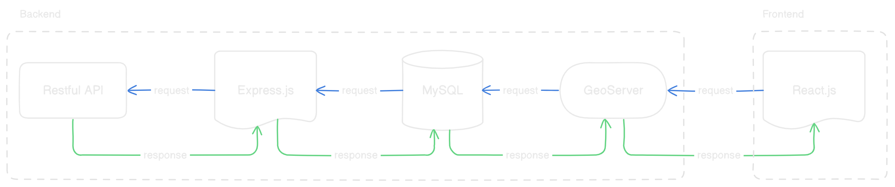

## Real Time Data

This repository is used to display a 3D terrain model with a main feature that visualizes real-time data in popups at each coordinate. Each coordinate represents the location of a sensor used to monitor various parameters, such as water conditions, weather, and more.

## Data requirements

- Coordinate sensor
- Building
- Dam boundary
- Terrain RGB tiles
- Satellite tiles

## Technology

- Express.js
- MySQL
- GeoServer
- React.js
- JavaScript
- SQL

## Architecture

The project consists of two main folders: backend and frontend. The backend folder is responsible for integrating parameter data sent from sensors via a RESTful API into the database. Then, GeoServer is connected to the database to retrieve the stored data resulting from this integration. Meanwhile, the frontend folder is used to display the data from GeoServer on a map dashboard using the WFS (Web Feature Service) method.
